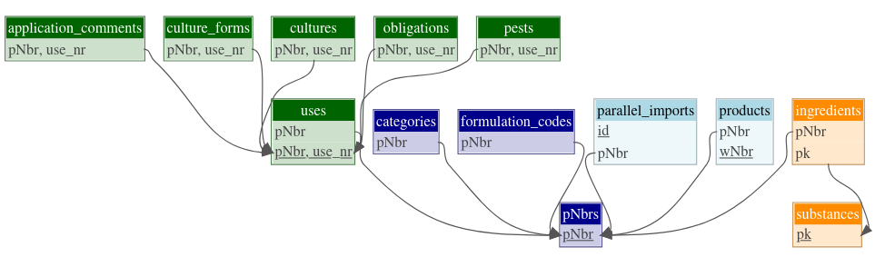

# Summary

Plant protection products (PPP) must be registered before they can be marketed
and used. During registration, they are tested for efficacy and side effects,
and can only be authorised if they do not pose unacceptable risks to humans,
animals or the environment, as assessed by the regulatory authorities.
Pesticides authorized for use in Switzerland are listed in the
Swiss Register of Plant Protection Products (SRPPP). 
The SRPPP contains information on active ingredient content of PPP, their uses
and the associated use restrictions. These data are available on a dedicated
website (<https://www.psm.admin.ch/de/produkte>). In addition, they are published 
in a custom format based on the Extensible Markup Language (XML). However,
neither format is suitable for more complex types of analysis. The
R package `srppp` greatly facilitates the access to these data, making them much
easier to use and therefore more valuable for research in ecotoxicology,
economics and regulatory science. The tables available in the data object
created by `srppp` as well as their relations are shown in \autoref{fig:srppp}.
Utility functions for searching for alternative PPP for certain uses, and for
calculating active substance application rates from product dosage information
are also included. 

# Statement of need

The current formats of SRPPP data in Switzerland are difficult to analyse,
hindering effective use by practitioners and researchers. Our open-source
R package `srppp` addresses this issue by providing easy and user-friendly
access to SRPPP data, like active substance content of products, application
areas, cultures and target organisms, as well as use restrictions. The 
package is therefore essential for researchers such as ecotoxicologists,
economists and other stakeholders who need reliable and efficient access to
information on the currently registered PPP, their uses and their use
restrictions.

In spite of the fact that the `srppp` package has just recently been 
developed, it has already been used for answering numerous requests 
and is actively being deployed in several projects. Projects like the National
Risk Indicator [@korkaric2023] that have previously used the SRPPP data have
suffered from the fact that previous approaches have partially lost information
in the course of processing the published data. These shortcomings can now be
avoided by using `srppp` which adheres more closely to the data structure
underlying the XML file. 

# Availability

The source code of the R package `srppp` is published under the GNU public licence
on [github](https://github.com/agroscope-ch/srppp). Installation packages for various
platforms are available via [R-Universe](https://agroscope-ch.r-universe.dev/ui/#package:srppp).
The online [documentation](https://agroscope-ch.github.io/srppp) contains
articles demonstrating the structure of the data and illustrates how to answer
specific questions on the products, their composition, their registered uses 
and the use restrictions defined in the course of authorisation.

# Main dependencies

For reading in the XML file, `srppp` relies on the functions in the
`xml2` package [@xml2]. The data read in are finally organised as tables in
a `dm` object [@dm], which is basically a pipe friendly way to work with
relational data in R without the need for an external database engine.

# Relationship to the Federal Food Safety and Veterinary Office 

The  Federal Food Safety and Veterinary Office, which
coordinates the registration of plant protection products in Switzerland, 
has noted the open source development of this software package,
but accepts no responsibility for the correctness of any functionalities
within. Further, they will not respond to queries regarding the package. Please
note that there is no guarantee that the data contained in or read by this
package will match the online version or the original registration documents.

# Related work

For those interested in historical data on authorized products and their uses, 
we refer to the srppphist R-package [@srppphist], which provides annual extracts 
of SRPPP data since 2011.

# Acknowledgements

We would like to acknowledge the helpful discussions with various members and
previous members of group, in particular Daniel Baumgartner and Jérôme
Schneuwly who shared their knowledge about the SRPPP data.

# References

